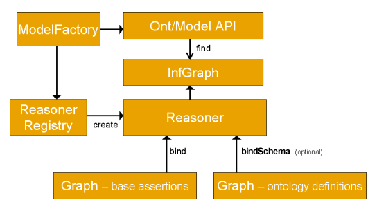

# Jena Inference 子系统

## 1. 概述

Jena inference子系统是用于实现推理的功能。具体的结构如下:



学习这个子系统，主要有以下几个方面：

1. InfModel对象，这个是由数据和推理器（reasoner）作为参数构建而成的模型，具有推理能力，也就是说我们最终都是通过对这个对象模型进行查询来获取我们的查询结果的。

2. Jena提供了四种类型的推理器
   
   1. 可传递性的推理
   2. RDFS规则推理
   3. OWL、OWL Mini、OWL Micro Reasoner：实现了OWL/Lite的推理机制。
   4. 自定义推理规则：支持用户自定义推理规则。
   
   其中，前三种会内置在通过ModelFactory创建的模型中，例如createRDFSModel()
   
3. InfoModel对象实例的获取方式。

4. Reasoner对象实例的获取方式、推理器的参数设置


因此Jena Inference子系统分为两大部分

1. InfModel(本章内容)
2. [Reasoner](./reasoner.md)

## 2. 获取InfModel对象实例的方式

1. 结合内置的reasoner和数据直接获取InfModel对象实例

    ```
    InfModel inf = ModelFactory.createRDFSModel(rdfsData);
    ```
    
2. 先分别获取reasoner和数据，再取得InfModel对象实例

    ```
    Reasoner reasoner = ReasonerRegistry.getRDFSReasoner();
    InfModel inf = ModelFactory.createInfModel(reasoner, rdfsData);
    ```
    
[完整示例](../src/main/com.jena-learning/inference/InferenceExample.java)

InfModel的本质是根据reasoner和data合成新的全面的rdf数据。注意两点：

1. 推理计算发生的时刻出现在结合reasoner和data返回新的RDF数据
2. 生成InfModel之后，后续的查询就仅仅是普通的查询。

我们在[示例](../src/main/com.jena-learning/inference/InfModelStore.java)中，将reasoner和data结合，生成的InfModel存储到文件`infmodel.ttl`中，打开文件可以看到本来就几条三元组数据被加上规则推理运算之后，扩充成了很多三元组数据。之后，我们通过读取`infmodel.ttl`文件，直接进行查询，就可以获取结果。

## 3. InfModel的属性方法


